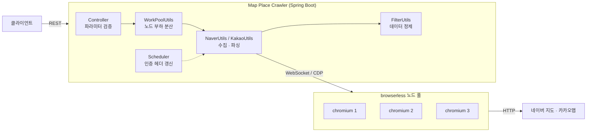

# Map Place Crawler

네이버 지도와 카카오맵의 장소 정보를 수집해 REST API로 제공하는 Kotlin·Spring Boot 기반 서버입니다. 장소 검색, 상세 정보, 리뷰 수, 사진, 주변 장소 등의 데이터를 수집하며, 서비스별 응답은 공통 형식으로 제공합니다.

수집 작업은 원격 browserless 노드 풀에 분산하고, Playwright로 GraphQL·JSONP 응답을 처리합니다. 실행 환경은 Docker와 환경변수 기반 설정으로 구성했습니다.

```
Kotlin 2.2 · Spring Boot 3.4 · Playwright · browserless · Gradle · Docker
```

---

## 주요 기능

- 네이버 지도·카카오맵 장소 검색 및 상세 정보 수집
- 리뷰 수, 사진 원본, 주변 테마 장소, 신규 오픈 정보 제공
- 서비스별 응답 DTO와 공통 응답 형식 제공
- browserless 다중 노드 워커 풀과 최소 부하 기반 작업 분배
- 브라우저 세션 기반 GraphQL·JSONP 요청 처리
- 프로파일별 환경 설정, Docker 실행 환경, GitHub Actions 빌드·테스트 구성

---

## 아키텍처



애플리케이션은 Playwright의 `connect()`로 원격 browserless 노드에 연결합니다. API 서버와 브라우저 자원을 분리했으며, 설정에 호스트를 추가하는 방식으로 워커 풀을 확장할 수 있습니다.

---

## 구현 방식

- Spring Boot 컨트롤러에서 요청 검증과 공통 응답 형식을 처리합니다.
- Playwright가 원격 browserless 노드에 연결해 GraphQL·JSONP 응답을 수집합니다.
- 현재 점유 수가 가장 적은 노드에 작업을 할당하고, 작업 종료 시 점유 수를 반환합니다.
- GraphQL 쿼리는 리소스 파일로 분리하고 서비스별 DTO로 응답을 파싱합니다.
- 반복 사용되는 요청 헤더는 캐싱하며, 브라우저·컨텍스트 자원은 작업별로 정리합니다.
- 잘못된 요청은 HTTP 400, 외부 서비스 수집 실패는 HTTP 502로 반환합니다.

---

## API

기본 경로는 `/api`, 포트는 `6085` 입니다. 모든 응답은 `status` 와 `storeList`(또는 `store`)를 갖는 공통 포맷입니다.

### 네이버 지도

| 메서드 | 경로 | 설명 | 파라미터 |
|---|---|---|---|
| GET | `/api/naver/list` | 키워드 장소 목록 (최대 300건) | `q` 검색어 |
| GET | `/api/naver/search` | 키워드 장소 단일 페이지 검색 | `q` 검색어 |
| GET | `/api/naver/restaurant/new` | 신규 오픈 음식점 목록 | `q` 지역명 |
| GET | `/api/naver/widget/{code}` | 장소 상세 정보 | `code` 장소 ID |
| GET | `/api/naver/marker/{code}` | 장소 요약 정보 | `code` 장소 ID |
| GET | `/api/naver/images/{code}` | 장소 사진 원본 URL 목록 | `code` 장소 ID |
| GET | `/api/naver/around/{topicId}` | 좌표 기준 테마별 주변 장소 | `lat`, `lng` |
| GET | `/api/naver/rcode/{typeId}/{rcode}` | 행정구역 기준 인기·신규 장소 | `limit` (기본 1000) |
| GET | `/api/naver/geocode` | 좌표 → 행정구역 코드 변환 | `x`, `y` |
| GET | `/api/naver/weather/{code}` | 행정구역 기준 날씨 | `code` 8자리 코드 |

`topicId` 와 `typeId` 는 대상 서비스의 내부 코드를 그대로 노출하지 않도록 `ParamValidateUtils` 에서 매핑합니다.

| topicId | 의미 | typeId | 의미 |
|---|---|---|---|
| `topic1` | 최신 오픈 | `type1` | 저장 랭킹 |
| `topic2` | 분위기 좋은 | `type2` | 인기 급상승 |
| `topic3` | TV 출연 맛집 | `type3` | 신규 오픈 |
| `topic4` | 착한 가격 | `type4` | 전체 |
| `topic5` ~ `topic8` | 24시간 · 혼밥 · 정찬 · 데이트 | | |

### 카카오맵

| 메서드 | 경로 | 설명 | 파라미터 |
|---|---|---|---|
| GET | `/api/kakao/list` | 키워드 장소 목록 (전체 페이지 순회) | `q` 검색어 |
| GET | `/api/kakao/totalCount` | 키워드 검색 결과 건수 | `q` 검색어 |
| GET | `/api/kakao/id/{code}` | 장소 상세 정보 | `code` 장소 ID |

### 운영

| 메서드 | 경로 | 설명 |
|---|---|---|
| GET | `/api/sessions` | 브라우저 노드별 현재 점유 수 |

---

## 실행 방법

### 1. 브라우저 노드 기동

```bash
docker compose up -d
```

`localhost:4001` ~ `4003` 에 browserless 노드 3대가 뜹니다.

### 2. 애플리케이션 실행

```bash
./gradlew bootRun
```

기본 프로파일은 `local` 이며 `src/main/resources-env/local/application.yml` 을 사용합니다.

### 3. 빌드 및 배포

```bash
./gradlew bootJar -Pprofile=prod
```

```bash
docker build -t map-place-crawler:1.0.0 .
```

프로파일별 설정은 `src/main/resources-env/{local,dev,prod}` 에 분리되어 있고, 빌드 시 해당 디렉터리만 리소스 경로에 포함됩니다. 운영 값은 코드에 두지 않고 환경변수로 주입합니다.

| 환경변수 | 설명 | 예시 |
|---|---|---|
| `BROWSERLESS_TOKEN` | browserless 인증 토큰 | `local-dev-token` |
| `BROWSERLESS_HOSTS` | 노드 목록 (쉼표 구분) | `10.0.0.11:4001,10.0.0.12:4001` |
| `LOG_DIR` | 로그 출력 경로 | `/logs` |

### 4. 테스트

```bash
./gradlew test
```
